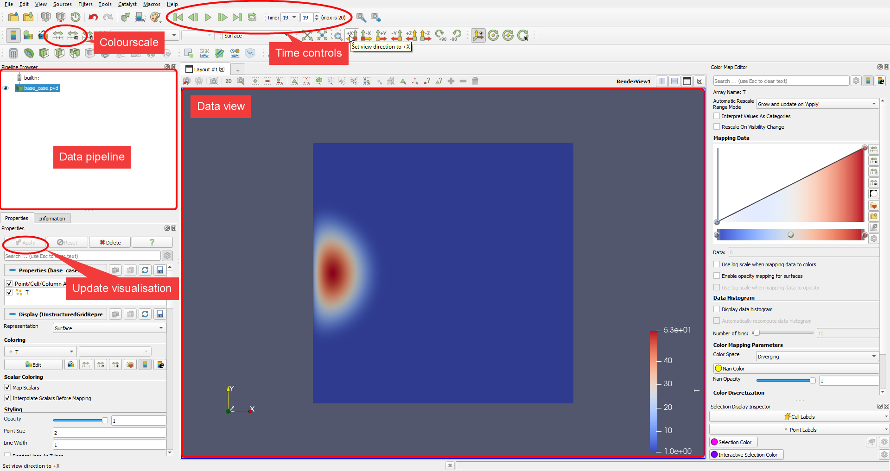
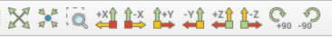
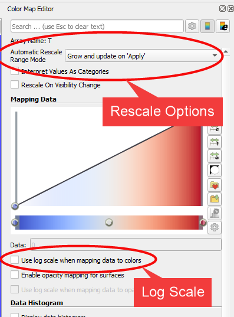
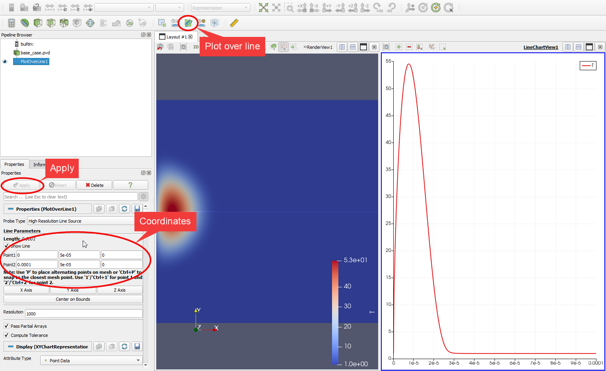
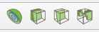

.. _paraview_tips:

Paraview Guide
==============

Paraview is the easiest way to visualise the results from TTiP but can be
confusing for new users. This section is dedicated to providing a getting
started guide for Paraview as well as some useful tips.

Getting Started
^^^^^^^^^^^^^^^

The first thing to do is download paraview from their website:
https://www.paraview.org/

Once Paraview is installed, open it up and you will be presented with a lot of
buttons, the most important are highlighted below.

Data Pipeline
-------------

The data pipeline will show all of the available data for visualising,
here datasets can be toggled on or off to switch which data is shown in the
Data View section.

If filters are applied to the data (for example taking slices) these will show
here too.

Update Visualisation
--------------------
This button, and those around it are used to control the dataset currently
selected in the data pipeline. When a new dataset is loaded in, the first thing
to do is hit apply.

Data View
---------
The data view will show everything that is set to be shown in the data pipeline.
This space is controlled by the mouse, and by default on windows these controls
are:

- *Left click + drag*: Translate
- *Right click + drag*: Zoom
- *Mouse wheel scroll*: Zoom
- *Middle click + drag*: Rotate

Time Controls
-------------
The time controls set which time is shown in the data view for all datasets.

Colourscale
-----------
The 2 buttons highlighted as colourscale allow you to set the colour to
a custom range or to the full visible range.

More Advanced
^^^^^^^^^^^^^

Resetting the View
------------------
The mouse controls can be awkward and hard to get correct. To reset this to one
of the axes, there are several buttons at the top of the screen.

Managing the Colour
-------------------
The right hand menu will give finer control over the colour settings.
Of particular note are the "*Automatic Rescale Range Mode*" and a
tick box to change to a logarithmic scale.

Two useful options for the autoscaling are "Never" and "Clamp and update"
"Never" will lead to a consistent scale accross all timesteps, while
"Clamp and Update" will ensure maximum range without saturating for every time
step.

Plotting a line
---------------
To plot a single line slice you can click the green "Plot over line" button,
enter some coordinates for the ends of the line, and click apply.
This plot can then be further controlled from the Properties tab (where the
coordinates were entered) by changing the titles, colours and labels.
Just be sure to apply any changes that are made.

Solid 3D objects
----------------
Visualing solid 3D objects will only show the boundary of the object, this
is probably not desired as it may be set to dirichlet (fixed) boundary conditions.

There are two easy ways to get around this: slicing and clipping.
The clip tool lets you partially hide an object, while the slice tool will
show the values along a plane. These both work in a similar way to the
line plotting above, but for 3D objects.

